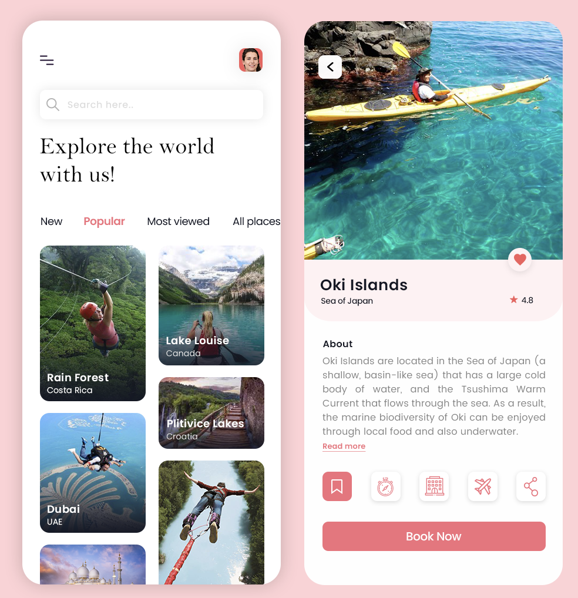
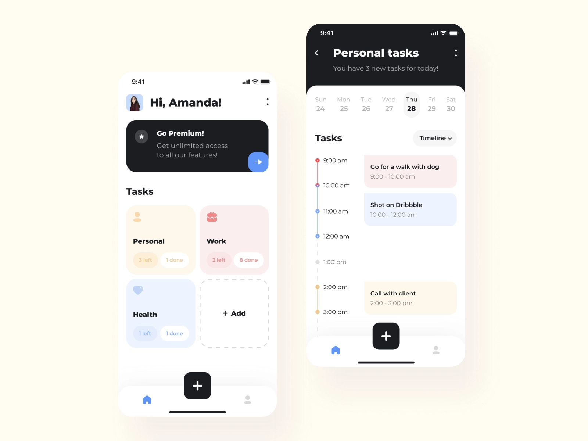
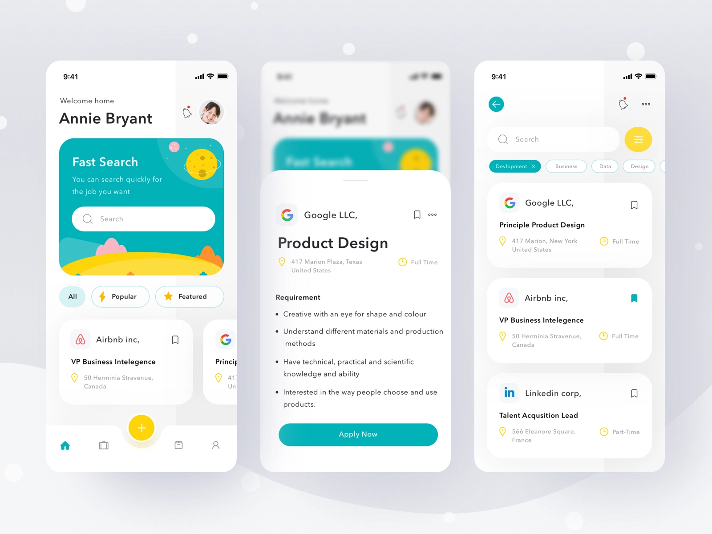

# ui_study

#### Menu
- Travel App
- House Rent App
- Adventure Travel App
- Course Learning App
- Messaging App
- Management app tool mobile application
- Job app
- Food app

##### Travel App 

##### House Rent App

##### Adventure Travel App

##### Course Learning App

##### Messaging App

- 服务端技术堆栈
  - 数据模型 Timeline模型 
    - https://github.com/aliyun/tablestore-examples
    - https://developer.aliyun.com/article/698301
    - 技术选型： TDengine
  - 热数据
    - redis
  - 关系数据
    - pgsql
  - mq
    - nsq有赞分支
      - https://github.com/youzan/nsq  
      - https://developers.weixin.qq.com/community/develop/article/doc/0000868f2f0768e2c57c1266051013
  - 推送
    - https://github.com/99designs/gqlgen
    - https://github.com/gorilla/websocket
    - https://pub.dev/packages/graphql_flutter
  - 音视频
    - https://github.com/langhuihui/monibuca
    - https://github.com/q191201771/lal
    - https://github.com/ZLMediaKit/ZLMediaKit
    - 常见流媒体协议
      - 1）RTP实时传输协议（Real-time Transport Protocol或简写RTP）： 用于直接封装音视频数据的封装载体，支持UDP或者TCP传输。 
      - 2）RTCP RTP Control Protocol： 一种调整协议，一般配合RTP使用。例如一对一通话时，接收端网络不好，那么接收端会将卡顿的问题通过RTCP协议发送给发送端，发送端收到后调整发送速率，例如降低码率、分辨率等等。 
      - 3）RTSP （Real Time Streaming Protocol），RFC2326，实时流传输协议： 安防方面使用最多，例如海康、大华、宇视等品牌都支持取rtsp流播放。可认为是一个容器，内部最终使用RTP、RTCP实现。因为RTP支持TCP、UDP，所以RTSP也是支持的，但也因为这样，所以会比较复杂。
例如rtsp的端口不管tcp还是udp，都只占用配置好的554端口。而在TCP下，RTCP视频、RTCP音频、RTP视频、RTP音频也是共同占用一个端口，并且也是554。
但是在UDP下，RTCP在音视频各自占1个，是独立的，RTP也是音视频各自一个，也是独立的。
此外，RTSP的交互还需要用到信令，它基于SDP协议。 
      - 4）RTMP RTMP是Real Time Messaging Protocol（实时消息传输协议)： 主要用于推流，拉流比较少，因为需要flash插件，所以在拉流方面逐渐被HTTP-FLV、HLS、WebRTC淘汰。
并且，RTMP目前主流是TCP，很少会有人支持UDP，如果使用UDP传输的话，那么你就不要选择RTMP。因为RTMP 内部没有处理数据丢包重传，如果用UDP的话，需要自己处理数据重传的问题，所以有的公司把数据传输这块改成quic的协议。 
      - 5）HTTP-FLV： HTTP-FLV可以推拉流，但是很少用于推流(估计是效果不如RTMP这些)，主要用于拉流，通过http协议，拉取flv协议格式的文件进行播放。flv不能直接在html的video标签播放，需要使用flv.js第三方插件处理。 
      - 6）HTTP-MP4： 主要用在点播，没办法用于直播。因为mp4必须要读到尾部即要等mp4流全部下载完后才能播放，而实时流你根本无法读到像文件末尾这样的尾部。
点播、录播、直播的区别：
点播就是我们平常点击视频后，它就可以播放，并且我们可以想放就放，可以想暂停就暂停，相当于播放一个文件，时长一般比较短。
而录播则是对直播的回放，它也是一个名义上的直播，我们不能想放就放，不能想暂停就暂停，例如央视回放某足球赛事，时长一般比较长，因为这类直播是知道视频的固定大小的，MP4对于完整的视频可以把box提到头部去，所以理论上HTTP-MP4应该也是支持录播的(可以自行百度，笔者未验证过)。
直播比较简单，就是我们平时在某鱼、某牙等等看到的直播。 
      - 7）HLS： 苹果公司推出的协议，该协议会将音视频数据切割成多个ts文件，m3u8文件会统计这些ts文件。电视播放目前主要就是使用这种协议。
优点：流畅度好，跨平台性好，rtmp不能在手机端播放，而http-flv在手机端支持也不是特别友好，而hls可以在web(html原生支持)、手机app(苹果原生的Safari浏览器原生支持)、手机小程序播放。可以无缝切换高清 / 标清的清晰度。例如，当切换清晰度时，后台在推流时会提前准备几套不同码率的视频，即高清、标清的推流。此时假设用户在读取一个时长为5秒的ts文件，在第二秒时，用户切换清晰度，那么下一秒(更具体点应该是下一帧)只需要换成高清的流即可。
缺点：正因为将音视频数据切成多个ts文件，所以延时比较大，一般在30s到2min左右。 
      - 8）WebRTC：Web的实时通话，如果你想要实时通话的话，那么WebRTC是唯一的方案，因为WebRTC才是双向交流的，而其它协议例如RTMP、HTTP-FLV这些要么只适合推流要么只适合拉流。在使用场景方面，在一对一实时通话、安防、云游戏等方面都已经在使用了。例如流媒体服务器SRS、ZLMEDIAKIT，安防方面的LiveGbs等等都已经在使用了。
因为目前前景都是趋于web化，例如人们看视频直播不想下载手机app、电脑客户端，而是想直接在网页就能观看，所以这个协议目前算是最火的一个。

    - WebRTC不能大规模直播(同时在线5000或者10000人以上算大规模)使用。因为WebRTC走UDP，如果中间转发节点多且网络不好，那么一层一层丢包下来，会导致画面严重失真。
如果直播并且不需要双向通话的话，那么使用rtmp推流，HTTP-FLV、HLS拉流是个很好的选择。

##### Management app tool mobile application

##### Job app

##### Food app

