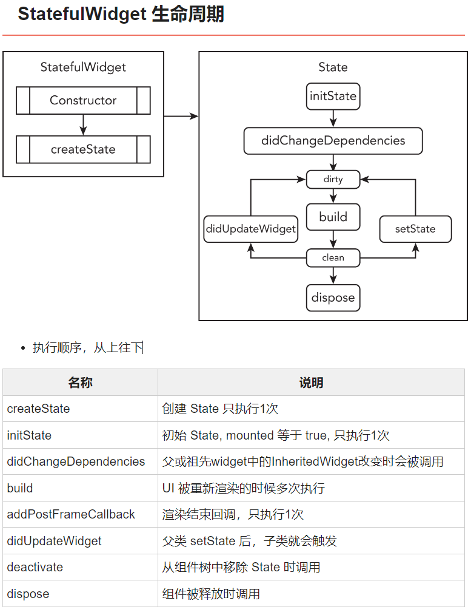

# Utility Components 实用组件

### 方便适用组件
- [FittedBox](https://api.flutter.dev/flutter/widgets/FittedBox-class.html) 根据适合度在其内部缩放和定位其子级。    
- SafeArea 安全空间
- [LayoutBuilder](https://book.flutterchina.club/chapter4/layoutbuilder.html)  获取父级 可以给的 空间范围值
- DefaultTextStyle 设定一个区域之间的默认文本
- 生命周期
- 页面监听-AppLifecyle (demo 隐私页面)
- [PageView and PageController](https://www.youtube.com/watch?v=sFXg-phkbQU) 
- [Slivers Overview: SliverAppBar, SliverPersistentHeader](https://www.youtube.com/watch?v=E3-WdYBrEDc)

##### SafeArea

``` 
SafeArea(
  left: false, // 是否避让 left 方向的缺陷
  right: false,
  minimum: EdgeInsets.all(8.0), // min padding
  child: Container(
    color: Colors.amber,
    width: double.infinity,
    child: FittedBox(
      child: const Text(
        'You have pushed the button this many times:',
      ),
    ),
  ),
),
```

##### LayoutBuilder

``` 
LayoutBuilder(
  builder: (BuildContext context, BoxConstraints constraints) {
    print(constraints); // 获取父级最大约束
    return SizedBox(
        height: constraints.maxHeight / 2,
        child: Text("lorem ipsum " * 400));
  },
)
```

##### DefaultTextStyle

`DefaultTextStyle.merge` 合并上级的 `DefaultTextStyle`
`DefaultTextStyle` 默认不合并上级的 `DefaultTextStyle`

``` 
DefaultTextStyle(
    style: TextStyle(color: Colors.amber),
    child: Center(
      child: Text("吃不葡萄不吐葡萄皮"),
    ),
)
```


##### 生命周期




##### 页面监听-AppLifecyle

``` 
  //  生命周期变化时回调
  //  resumed:应用可见并可响应用户操作,app进入前台
  //  inactive:用户可见，但不可响应用户操作，比如来了个电话,前后台切换的过渡状态
  //  paused:已经暂停了，用户不可见、不可操作，app进入后台
  //  suspending：应用被挂起，此状态IOS永远不会回调
  @override
  void didChangeAppLifecycleState(AppLifecycleState state) {
    super.didChangeAppLifecycleState(state);
    print("didChangeAppLifecycleState: $state");
  }
```


##### PageView PageController


// 默认为 左右滑动
``` 
  @override
  Widget build(BuildContext context) {
    return Scaffold(
      appBar: AppBar(
        title: const Text("Page View"),
        actions: [
          InkWell(
            child: Icon(Icons.keyboard_arrow_left),
            onTap: () {
              // controller.animateToPage(
              //     controller.initialPage == 0 ? 0 : controller.initialPage - 1,
              //     duration: const Duration(seconds: 1),
              //     curve: Curves.easeInOut);
              controller.previousPage(
                  duration: const Duration(seconds: 1),
                  curve: Curves.easeInOut);
            },
          ),
          InkWell(
            child: Icon(Icons.keyboard_arrow_right),
            onTap: () {
              controller.nextPage(
                  duration: const Duration(seconds: 1),
                  curve: Curves.easeInOut);
            },
          )
        ],
      ),
      body: PageView(
        controller: controller,
        scrollDirection: Axis.vertical, // 上下滑动
        children: [
          Container(
            color: Colors.red,
            child: const Center(
              child: Text('Page 1'),
            ),
          ),
          Container(
            color: Colors.indigo,
            child: const Center(
              child: Text('Page 2'),
            ),
          ),
          Container(
            color: Colors.green,
            child: const Center(
              child: Text('Page 3'),
            ),
          )
        ],
      ),
    );
  }
```